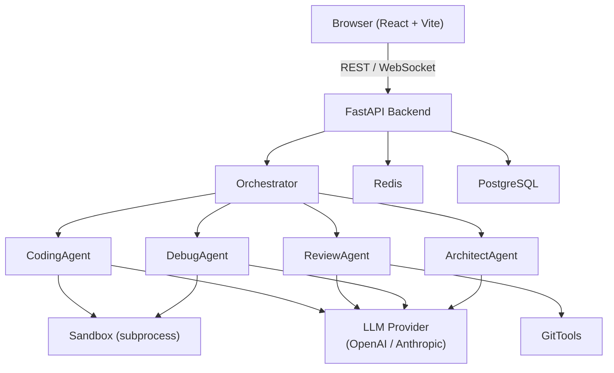

# OmniAgent — Autonomous Multi-Agent Software Engineer

OmniAgent is an open-source platform that orchestrates specialised AI agents to autonomously write, review, debug, and architect software. Multiple agents collaborate through structured pipelines, communicate via message-passing, and stream their work in real time.

## Features

| Feature | Description |
|---------|-------------|
| AI Coding Agents | Multiple specialised agents: Coding, Review, Debug, Architect |
| Task Orchestration | Chain agents into multi-step pipelines with shared context |
| Repo Analysis | Parse git repositories, understand structure and language breakdown |
| Autonomous Debugging | Run code, catch errors, analyse root cause, produce fixes |
| PR Review | Diff analysis with severity-graded issues and actionable suggestions |
| Terminal Sandbox | Subprocess execution with timeout and resource protection |
| Architecture Generation | Generate project scaffolds, ADRs, and Mermaid diagrams |
| Multi-Agent Collaboration | Agents share context; results flow from step to step |
| Streaming UI | WebSocket-based real-time output in a dark-theme React dashboard |

## Architecture



## Tech Stack

| Layer | Technology |
|-------|-----------|
| Backend | Python 3.12, FastAPI, Uvicorn, Pydantic v2 |
| AI Providers | OpenAI (`gpt-4o-mini`), Anthropic (`claude-sonnet-4-6`) |
| Frontend | React 18, TypeScript, Vite, Tailwind CSS |
| Infrastructure | Docker, PostgreSQL 16, Redis 7, Nginx |
| Code Quality | Ruff, pytest, vitest, GitHub Actions |

## Quick Start

### With Docker (recommended)

```bash
git clone <repo-url> && cd omni-agent
cp .env.example .env        # Fill in your API keys
docker-compose up --build
```

- Frontend: http://localhost:3000
- Backend API: http://localhost:8000
- API Docs: http://localhost:8000/docs

### Manual Setup

```bash
bash scripts/setup.sh

# Terminal 1 — Backend
cd backend
source .venv/bin/activate   # Windows: .venv\Scripts\activate
uvicorn main:app --reload

# Terminal 2 — Frontend
cd frontend
npm run dev                  # http://localhost:5173
```

## Environment Variables

| Variable | Description | Default |
|----------|-------------|---------|
| `OPENAI_API_KEY` | OpenAI API key | (empty) |
| `ANTHROPIC_API_KEY` | Anthropic API key | (empty) |
| `DATABASE_URL` | PostgreSQL connection string | see `.env.example` |
| `REDIS_URL` | Redis connection string | `redis://redis:6379` |
| `SECRET_KEY` | Application secret | change in production |
| `MAX_AGENT_ITERATIONS` | Max LLM loops per task | `10` |
| `SANDBOX_TIMEOUT` | Code execution timeout (seconds) | `30` |

> At least one of `OPENAI_API_KEY` or `ANTHROPIC_API_KEY` must be set for real LLM responses. Without keys the platform runs in stub mode for development.

## API Reference

See [docs/API.md](docs/API.md) for the full API reference.

### Key endpoints

```
GET  /health                   — Service health check
GET  /api/v1/agents            — List available agents
POST /api/v1/agent/run         — Run a single agent
POST /api/v1/repo/analyze      — Analyse a local repository
POST /api/v1/pr/review         — Review a PR diff
POST /api/v1/debug             — Debug code + error
WS   /ws/agent/{task_id}       — Stream agent output
```

## Project Structure

```
omni-agent/
├── backend/
│   ├── main.py               # FastAPI app entry point
│   ├── agents/               # Specialised AI agents
│   ├── tools/                # Git, sandbox, diff, code utilities
│   └── shared/               # Config, logging, Pydantic models
├── frontend/
│   └── src/
│       ├── components/       # AgentChat, PRReviewer, Terminal, ...
│       └── pages/            # Dashboard, AgentWorkspace
├── docs/                     # Architecture and API docs
├── scripts/                  # Setup automation
├── Dockerfile
└── docker-compose.yml
```

## Inspired By

OmniAgent is inspired by the ideas and designs of these excellent open-source projects:

- [OpenHands](https://github.com/All-Hands-AI/OpenHands) — autonomous software development agents
- [SWE-agent](https://github.com/princeton-nlp/SWE-agent) — LLM agents for software engineering tasks
- [crewAI](https://github.com/crewAIInc/crewAI) — multi-agent orchestration framework
- [ChatDev](https://github.com/OpenBMB/ChatDev) — LLM-based software development simulation
- [pr-agent](https://github.com/Codium-ai/pr-agent) — AI-powered code review

OmniAgent is an original implementation and does not copy or redistribute code from any of the above.

## Contributing

See [CONTRIBUTING.md](CONTRIBUTING.md) for guidelines.

## License

MIT — see [LICENSE](LICENSE).
