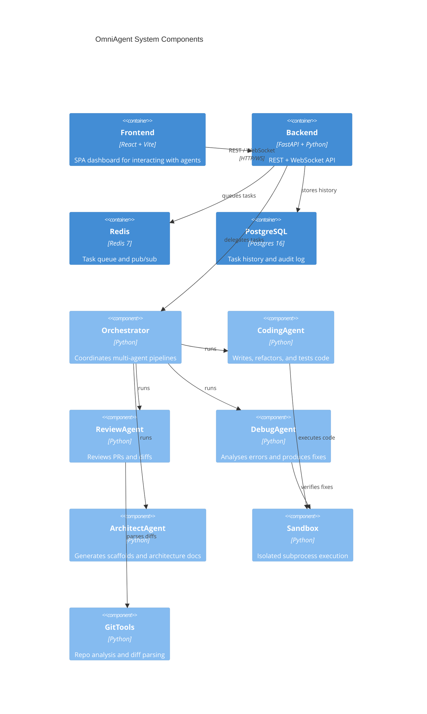

# OmniAgent — Architecture

## Overview

OmniAgent is a multi-agent software engineering platform built around a FastAPI backend and a React frontend. Agents communicate through the Orchestrator, which coordinates task pipelines.

## Component Diagram

## Data Flow

1. User submits a task via the dashboard.
2. Frontend sends a REST POST or opens a WebSocket to `/ws/agent/{task_id}`.
3. `main.py` validates the request with Pydantic models.
4. `Orchestrator.run_single()` or `stream_agent()` is called.
5. The appropriate agent calls the configured LLM provider (OpenAI / Anthropic).
6. For code/debug tasks, the Sandbox validates output by running it.
7. Results are streamed back via WebSocket or returned as JSON.

## Agent Design

All agents extend `BaseAgent` which provides:
- `_call_llm()` — provider-agnostic LLM call with graceful fallback
- `run()` — abstract method each agent must implement
- `stream()` — default streaming that wraps `run()`
- `to_info_dict()` — serialisation for the `/api/v1/agents` endpoint

## Security Model

- Sandbox uses `asyncio.create_subprocess_exec` (not shell=True).
- Subprocess timeout enforced via `asyncio.wait_for`.
- Dangerous environment variables (`LD_PRELOAD`, `PYTHONPATH`) stripped.
- Non-root user in Docker container.
- CORS restricted to known frontend origins.
